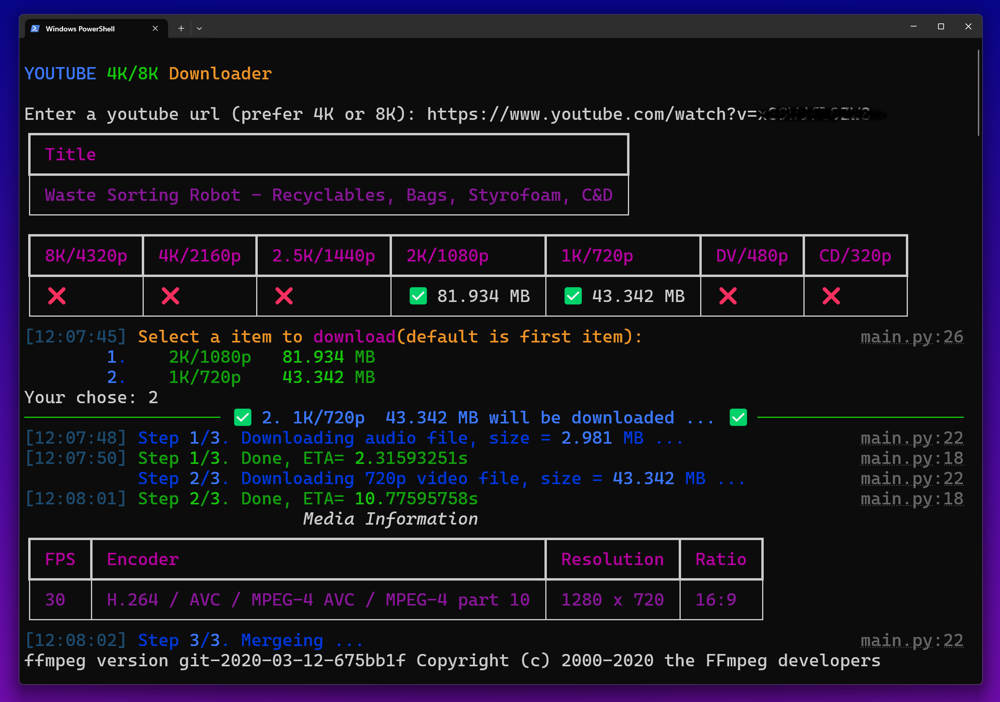

# 🎬 Youtube 4K/8K downloader (2025)




<br/>
<br/>

A simple python script for downloading 4K/8K YOUTUBE video

[Features]  

- Support 4K/8K video download
- Support proxies
- Beautiful console output  

## 1. Dependencies
1. in terminal
    ```sh
    brew install ffmpeg
    ```
2. in python code
    ```python
    pytubefix
    rich
    ffmpeg-python
    ```

## 2. Installation

```sh
pip install -r requirements.txt
```

## 3. Run

1. in python
    ```
    python main.py
    ```

2. in jupyter
    ```
    jupyter notebook
    ```

## 4. Known Issues
1. Download failed. 
    1. Rerun this code
    2. Try changing the backend proxy and IP
    
2. Download 8K video, need to provide, [see this](https://pytubefix.readthedocs.io/en/latest/user/po_token.html).
    1. `YouTube(url_8k, use_po_token=True)`
    2. poToken
    3. visitorData  


## 5. GPL3 license

This code is only for learning.  
Please **DO NOT** use it commercially.   
If there are any adverse consequences, it has nothing to do with me.

Enjoy it 😊


